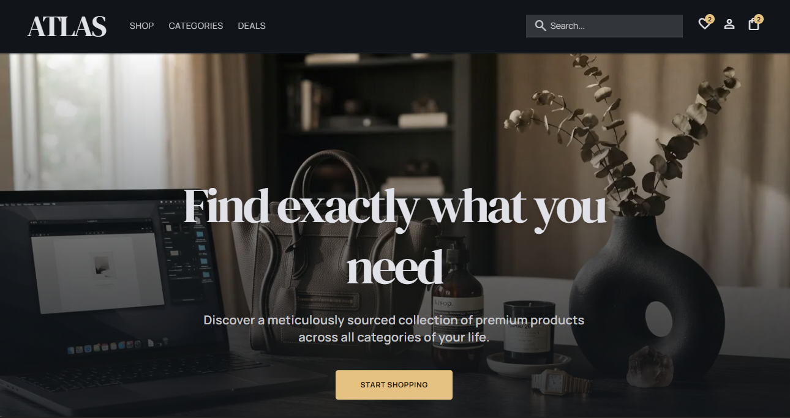
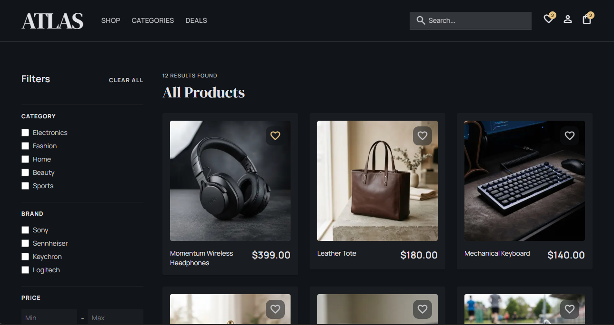
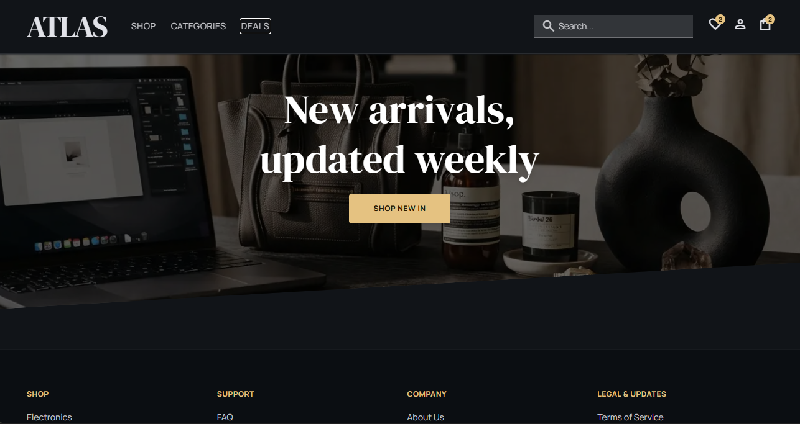
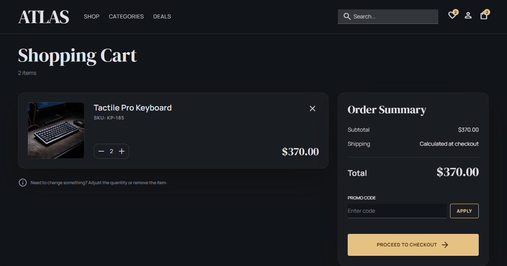
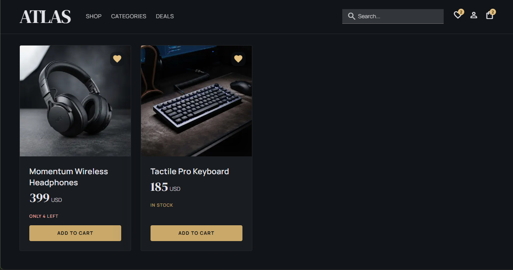
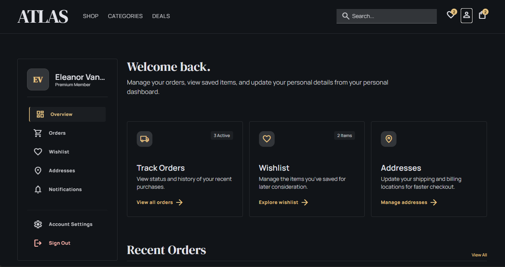
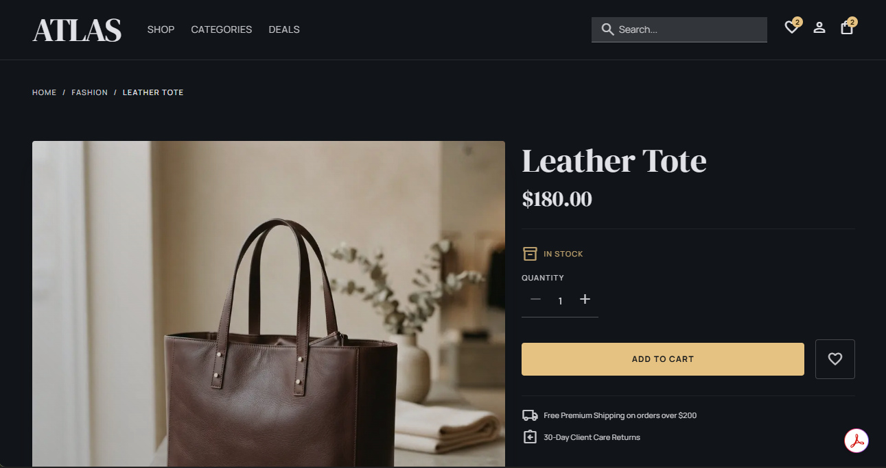

<div align="center">

# Atlas Marketplace

**A full-featured, dark-themed ecommerce storefront** — built with Next.js 16 + TypeScript.
Designed to run against an external microservices backend, but every flow works client-side
out of the box with rich offline demo data.

<br/>

[](https://ecommerce-platform-web-peach.vercel.app/)
[](https://nextjs.org)
[](https://react.dev)
[](https://www.typescriptlang.org)
[](https://tailwindcss.com)
[](LICENSE)

</div>



## Screenshots

<p align="center">
  
  
  
  
  
  
</p>

## Features

### Storefront
- Home page with hero, category grid, trending products, and promotional sections
- Product detail pages with breadcrumbs, live stock levels, add-to-cart/wishlist, reviews, and curated pairings
- Full-text search with category, brand, and price-range filters plus autocomplete suggestions
- Categories: Electronics, Fashion, Home, Beauty, Sports

### Checkout (demo — no real payment)
- Two-step checkout: address picker then review
- Promo code support (`ATLAS10` for 10% off)
- Delivery speed selection (Standard / Express)
- Simulated payment processing (card, PayPal, cash on delivery)
- Order confirmation with localStorage persistence

### Account Hub
- Dashboard, profile/settings, saved addresses (CRUD)
- Order history with tracking timeline, carrier info, and printable invoice
- Wishlist, notifications, auth pages (login, register, forgot/reset password, email verification)

### Seller Hub
- Product management (list, add, edit)
- Order status management
- Inventory/stock updates
- Review replies
- Store profile and payout settings

### Admin Console
- Promotions management (create, toggle, schedule promo codes)
- Review moderation queue (approve, reject, flag)
- Seller account management

### Info Pages
- About, FAQ, shipping, returns, contact, terms, privacy, become-a-seller

## Live Demo

Deployed on [Vercel](https://vercel.com) (created with [Stitch](https://stitch.vercel.ai)):

> **https://ecommerce-platform-web-peach.vercel.app/**

The demo runs fully client-side — no backend services are required in production.

## Tech Stack

| Layer | Choice |
|---|---|
| Framework | Next.js 16 (App Router, React Server Components) |
| React | 19 |
| Language | TypeScript 5 (strict mode) |
| Styling | Tailwind CSS v4, dark Material-3-like palette |
| State | React Context + custom SSR-safe localStorage store |
| Icons | Material Symbols Outlined |
| Data | No database — all demo state persists in browser localStorage |

## Backend Microservices

The frontend talks to an external, event-driven microservices backend behind an API gateway via a typed client in `src/lib/api/`. The app degrades gracefully to the offline demo catalogue when the gateway is unreachable.

| Service | Endpoints |
|---|---|
| Auth | `POST /auth/login`, `POST /auth/register`, `POST /auth/refresh`, `POST /auth/logout` |
| Catalog | `GET /categories`, `GET /brands` |
| Products | `GET /products/{sku}` |
| Search | `GET /search`, `GET /search/autocomplete` |
| Stock | `GET /stock/{sku}` |
| Cart | `GET /cart`, `POST /cart/items`, `PUT /cart/items/{sku}`, `DELETE /cart/items/{sku}` |
| Reviews | `GET /reviews?productId=` |

> Auth uses client-side JWT access + refresh tokens (localStorage). A cookie-based backend-for-frontend is recommended before a public launch — this is an acknowledged demo trade-off.

## Getting Started

```bash
npm install
npm run dev
```

Open [http://localhost:3000](http://localhost:3000).

The app runs fully offline with seeded demo data. No backend is needed.

### Environment Variables

| Variable | Default | Description |
|---|---|---|
| `NEXT_PUBLIC_API_URL` | `http://localhost:8080` | Base URL for the external microservice gateway |
| `NEXT_PUBLIC_ENABLE_DEMO_STATES` | `false` | Enable `?state=` URL param previews (error/loading/empty variants) |

## Project Structure

```
src/
  app/
    (store)/         — Main storefront, account, auth pages
    (checkout)/      — Checkout flow (minimal shell)
    (seller)/        — Seller hub dashboard
    (admin)/         — Admin console
  components/        — ~65 components organized by domain (home, product, cart, checkout, etc.)
  lib/
    api/             — Typed API client for external microservices (catalog, search, cart, reviews, stock)
    auth/            — Client-side JWT session management (access + refresh tokens)
    demo/            — Offline demo data and info page content
    utils/           — localStorage store, helpers
```

## Contributing

Contributions are welcome. See [CONTRIBUTING.md](CONTRIBUTING.md) for guidelines.

## License

[MIT](LICENSE) © ATUMANYIRE